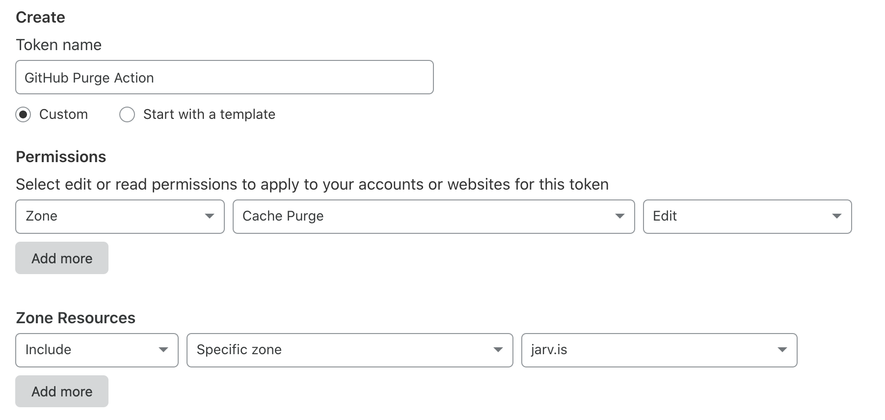

# GitHub Action to Purge Cloudflare Cache  🗑️ 

Based on [this Action](https://github.com/jakejarvis/cloudflare-purge-action) from jakejarvis which seems unmaintained, and merged [this PR](https://github.com/jakejarvis/cloudflare-purge-action/pull/2) from chabad360 to work with the new YAML syntax.

This simple action calls the [Cloudflare API](https://api.cloudflare.com/#zone-purge-all-files) to purge the cache of your website, which can be a helpful last step after deploying a new version.


## Usage

All sensitive variables should be [set as encrypted secrets](https://help.github.com/en/articles/virtual-environments-for-github-actions#creating-and-using-secrets-encrypted-variables) in the action's configuration.


### `workflow.yml` Example

Place in a `.yml` file such as this one in your `.github/workflows` folder. [Refer to the documentation on workflow YAML syntax here.](https://help.github.com/en/articles/workflow-syntax-for-github-actions)

```yaml
name: Deploy my website
on: push

jobs:
  deploy:
    runs-on: ubuntu-latest
    steps:
    # Put other steps here if you'd like, i.e. to build your site, deploy it to a service, etc.
    - name: Purge cache
      uses: Jonakemon/purge-cache-cloudflare-zone
      with:
        cloudflareZone: ${{ secrets.CLOUDFLARE_ZONE }}
        cloudflareApiKey: ${{ secrets.CLOUDFLARE_API_KEY }}
```


### Configuration Variables

| Key | Value | Suggested Type | Required |
| ------------- | ------------- | ------------- | ------------- |
| `cloudflareZone` | The Zone ID of your domain, which can be found in the right sidebar of your domain's overview page on the Cloudflare dashboard. For example, `xyz321xyz321xyz321xyz321xyz321xy`. | `secret` | **Yes** |
| `cloudflareApiKey` | Your Cloudflare API key, which can be generated using [these instructions](https://support.cloudflare.com/hc/en-us/articles/200167836-Where-do-I-find-my-Cloudflare-API-key-). For example, `abc123abc123abc123abc123abc123abc123abc123abc`. | `secret` | **Yes** |


### Creating a restricted API token on Cloudflare

API Tokens are [a feature](https://blog.cloudflare.com/api-tokens-general-availability/) that allows you to restrict the scope of this action to only purging the cache of zones you specify. In other words, this is much safer than allowing this action complete control of your entire Cloudflare account.

Creating a token is easy; here's an example of what you should enter [on this page](https://dash.cloudflare.com/profile/api-tokens) to create a token for purging the cache of a single domain on your account:




## License

This project is distributed under the [MIT license](LICENSE.md). It is based on a [similar repository from jakejarvis](https://github.com/jakejarvis/cloudflare-purge-action).
